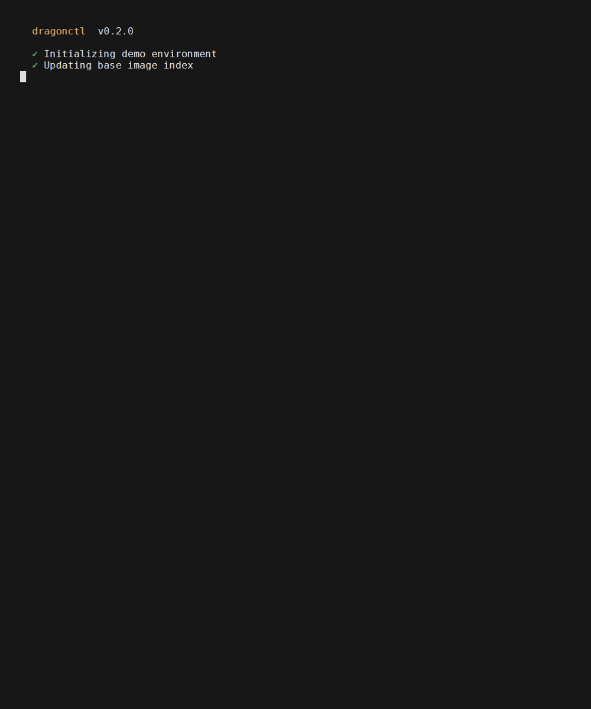
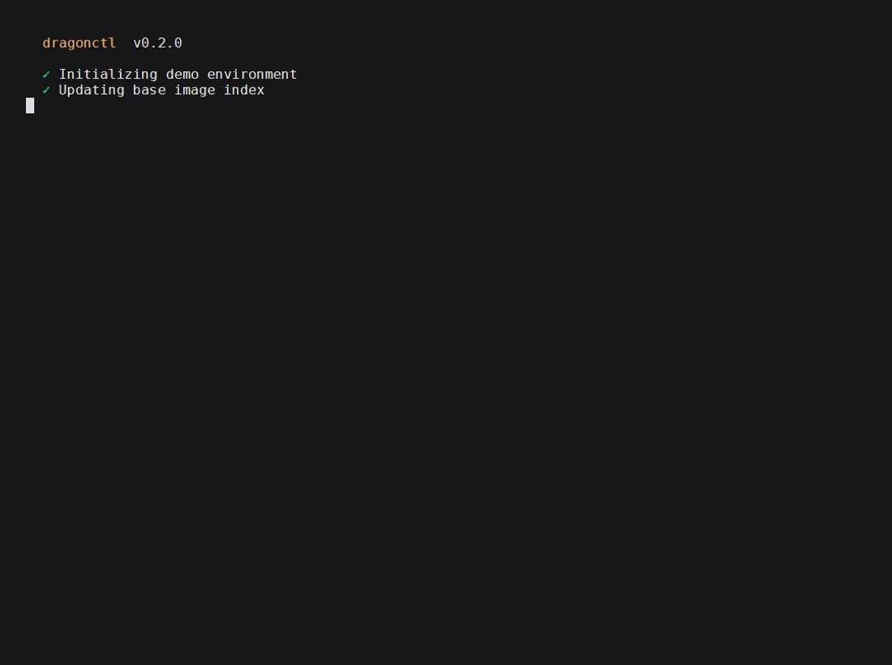

<div align="center">

<!-- Paste your TAAG banner here if you want it, generated at https://patorjk.com/software/taag -->

# Inkling

**Reveal ASCII art as a progress indicator.**

[](https://crates.io/crates/inkling-loader)
[](https://docs.rs/inkling-loader)
[](https://pypi.org/project/inkling-loader/)
[](https://github.com/codizzler/inkling/actions/workflows/ci.yml)
[](https://crates.io/crates/inkling-loader)
[](LICENSE-MIT)

Inkling maps progress onto the order a picture's glyphs appear. A normal bar fills a
line; Inkling paints a drawing, one glyph at a time, as your task runs. The name is
literal: the engine calls every non blank glyph *ink*, and an inkling is something
slowly taking shape.


<sub>Rust · zero dependency core · Windows, macOS, Linux</sub>

</div>

---

## Why

Progress bars are a solved problem and a dull one. Inkling treats the loader as a small
canvas without giving up what a real progress API needs: a known total, increments from
any thread, iterator and reader wrappers, indeterminate spinners, a rainbow palette, and
correct terminal handling. The picture is the bonus. The ergonomics are the point.

## Install

```sh
cargo add inkling-loader
```

It publishes as `inkling-loader` because the short name is taken; the import path is
`inkling`. Before the first crates.io release, track git instead:

```toml
[dependencies]
inkling-loader = { git = "https://github.com/codizzler/inkling" }
```

Not writing Rust? There is a CLI and a Python package too, see
[Using it from other languages](#using-it-from-other-languages).

## Usage

The front door is `Loader`. Give it a total, advance it as work completes, finish it. A
background thread repaints a live reveal at about 30 fps, inline in the terminal, so your
next line of output follows directly below it. Updates are lock free, so any thread can
report progress.

```rust
use inkling::prelude::*;

let loader = Loader::new(1000);
loader.set_message("Downloading");
for _ in 0..1000 {
    do_a_slice_of_work();
    loader.inc(1);
}
loader.finish();
```

Wrap an iterator and it advances itself, taking the total from `size_hint`:

```rust
use inkling::prelude::*;

for item in items.iter().inkling() {
    process(item);
}
```

That `use inkling::prelude::*;` is the one import most programs need: it brings `Loader`,
the `.inkling()` adaptor, and `Art`.

Wrap a reader and bytes advance it, which is what a download wants:

```rust
let loader = Loader::new(content_length);
let mut body = loader.wrap_read(response);
std::io::copy(&mut body, &mut file)?;
loader.finish();
```

Without a total, `Loader::spinner()` runs an indeterminate, breathing reveal. The builder
swaps the art, ordering, palette, or message:

```rust
use inkling::{Art, Loader, ordering::Geodesic, render::Style};

let loader = Loader::builder()
    .total(500)
    .art(Art::parse(include_str!("../art/whale.txt")))
    .ordering(Geodesic::default())    // trace the spine instead of the default wipe
    .style(Style::rainbow())          // lolcat style colouring
    .message("Rendering")
    .start();
```

`Loader` restores the terminal on finish or drop. Off a TTY (a pipe or CI) it prints the
finished art once instead of animating, so the same code is correct in both places. Try
`cargo run --example download` and `cargo run --example download -- rainbow`, or
`cargo run --example loader` for the `iter`, `spinner`, `threads`, and `rainbow` variants.

### Lower level control

`Loader` is a thin layer over a small core. Drive a `Reveal` directly with
`render(progress)` for frame by frame control, animate over a fixed duration with
`animate`, or render one frame to a `String` with `frame::to_string`. That last one has
no dependencies and is the ground truth the tests check against.

## How it reveals

Everything reduces to one value, the **reveal rank**. Each ink cell gets a rank in
`0..=1`, and a cell is visible exactly when `rank <= progress`:

```text
rank : cell -> 0..=1
visible(p) = { cell | rank(cell) <= p }
```

Rank is fixed and monotonic, so the reveal cannot run backwards, any progress value
renders directly (it is seekable and resumable), and a frame is a pure function of
progress. Assigning ranks is the one pluggable seam, the `Ordering` trait:

- **`Directional`** (the default) wipes along one axis. Tall art paints top to bottom, wide
  art left to right, and nothing shows until the wipe reaches it. It is the intuitive read
  for a loader, and it honours right to left locales with `Directional::reading()`.
- **`Geodesic`** is the signature reveal. It treats the ink as a graph, takes the largest
  connected component, finds the spine with a double BFS sweep, and ranks each cell by
  geodesic distance along it, so a serpent paints from one tip to the other along its own
  body. Hand-drawn art is usually many separate strokes, so when the ink is fragmented it
  bridges the small gaps and still traces the whole body head to tail; already-connected art
  is traced strictly. Detached ink inherits the rank of its nearest spine cell, so loose
  detail reveals beside the part it belongs to rather than dumping at the end.
- **`Scanline`** is the plain reading order baseline. Bring your own by implementing the
  trait.

```text
art       a grid of glyphs; whitespace is background
rank      RankMap: each ink cell's reveal rank in 0..=1
ordering  Ordering trait turns art into a RankMap (Directional, Geodesic, Scanline, yours)
easing    timing curves
frame     pure text render of one frame; zero dependencies; the test ground truth
loader    Loader: the thread safe handle (inc/set, iterator and reader wrap)   [feature]
render    crossterm renderer: Reveal, animate, palettes; diff based            [feature]
```

The core (`art`, `rank`, `ordering`, `easing`, `frame`) is pure `std` with zero
dependencies and builds with `--no-default-features`. Only the terminal layer pulls in
[`crossterm`](https://crates.io/crates/crossterm), behind the default `terminal` feature.

## Using it from other languages

Inkling is a Rust library, so Rust programs use it directly. For everyone else the same
engine ships two ways, both thin wrappers over the pure core:

**The `inkling` CLI** is the language-agnostic bridge. Pipe progress to it the way you pipe
to `pv`, no bindings to link against, so bash, Make, or any language can drive the reveal:

```sh
cargo install inkling-cli          # installs the `inkling` binary
seq 0 100 | inkling --total 100
```

**A Python package** on PyPI, installed as `inkling-loader` and imported as `inkling`,
exposes the same `Loader` as a context manager:

```sh
pip install inkling-loader
```

```python
from inkling import Loader

with Loader(total=len(items), rainbow=True) as bar:
    for it in items:
        work(it)
        bar.inc()
```

Node (napi) and a WebAssembly build are next; the core was kept small and dependency free
precisely so these stay thin.

## Behaviour

| Platform | Notes |
| --- | --- |
| Windows 10+ | Virtual terminal sequences are enabled automatically. Windows Terminal gives truecolor. |
| macOS, Linux | Any modern terminal. |

Inkling honours `NO_COLOR`, never writes escape codes when output is not a terminal, and
falls back to a single plain frame when there is no TTY. Wide glyphs (CJK and many emoji)
are aligned by display width, and every frame is bracketed in synchronized output
(DEC 2026) so terminals that support it repaint without tearing.

## Showcase

Recordings live in `docs/`. See [docs/recording-gifs.md](docs/recording-gifs.md) for a one
command way to capture them with `vhs`.

| Reveal | What it shows |
| --- | --- |
|  | The default directional wipe, glow palette, painting a dragon top to bottom |
|  | The rainbow (lolcat) palette |
|  | The geodesic spine trace painting a serpent along its body |

## Roadmap

- Node (napi) and WebAssembly bindings, alongside the existing CLI and Python package.
- An authored path layer, so the reveal direction can be drawn by hand.
- Zhang and Suen skeleton thinning to refine the spine on thick art.

## Credits

- ASCII art comes from the community at [asciiart.eu](https://www.asciiart.eu/). Artist
  signatures live in the art files; keep them when you reuse a piece.
- The logo banners were made with
  [patorjk's Text to ASCII Art Generator](https://patorjk.com/software/taag/).
- The terminal layer stands on [crossterm](https://crates.io/crates/crossterm).

## License

MIT. See [LICENSE-MIT](LICENSE-MIT).
