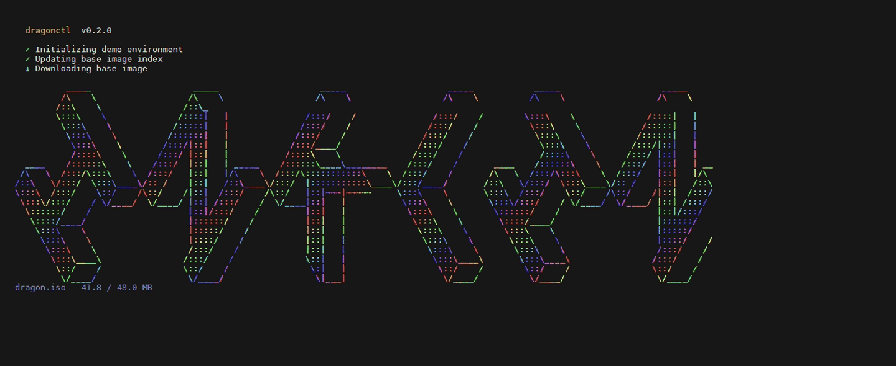
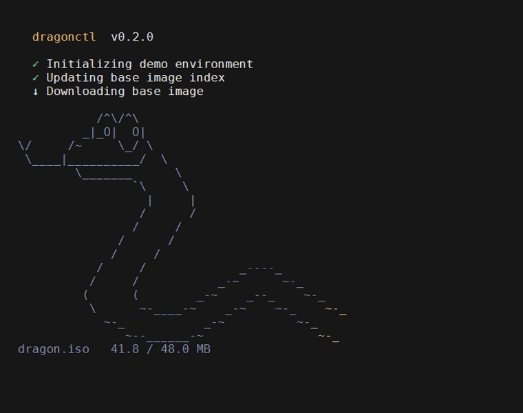
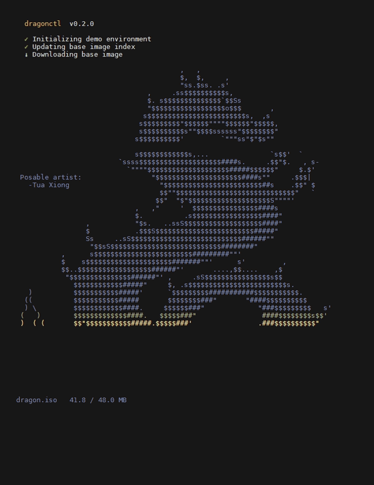
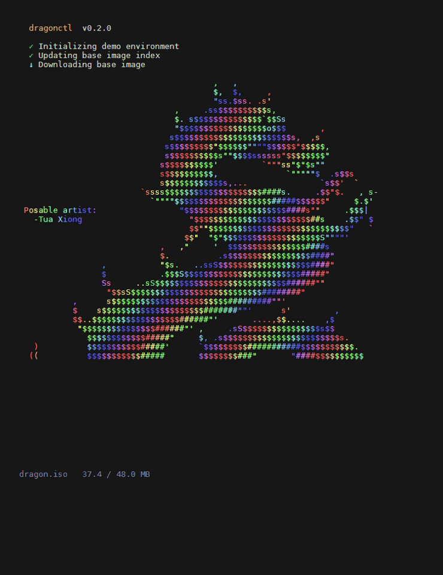

<div align="center">

# Inkling

**Reveal ASCII art as a progress indicator.**

[](https://crates.io/crates/inkling-loader)
[](https://docs.rs/inkling-loader)
[](https://pypi.org/project/inkling-loader/)
[](https://www.npmjs.com/package/inkling-loader)
[](https://www.npmjs.com/package/inkling-wasm)
[](https://github.com/codizzler/inkling/actions/workflows/ci.yml)
[](https://crates.io/crates/inkling-loader)
[](LICENSE)

**Get started in your language:**
[Rust](#install) · [CLI / any shell](#command-line-for-any-language-or-shell) · [Python](#python) · [Node](#node) · [Browser / WASM](#browser-webassembly)

Inkling maps progress onto the order a picture's glyphs appear. A normal bar fills a
line; Inkling paints a drawing, one glyph at a time, as your task runs. The name is
literal: the engine calls every non blank glyph *ink*, and an inkling is something
slowly taking shape.



<sub>Rust · zero dependency core · Windows, macOS, Linux</sub>

</div>

---

## Why

Progress bars are a solved problem and a dull one. Inkling treats the loader as a small
canvas without giving up what a real progress API needs: a known total, increments from
any thread, iterator and reader wrappers, indeterminate spinners, elapsed/rate/ETA,
printing above a live bar, a rainbow palette, and correct terminal handling on the way
out, including Ctrl+C. The picture is the bonus. The ergonomics are the point.

## Install

```sh
cargo add inkling-loader
```

It publishes as `inkling-loader` because the short name is taken; the import path is
`inkling`. The minimum supported Rust version is **1.74**, checked in CI.

Not writing Rust? There is a CLI, a Python package, a Node addon, and a WASM build, see
[Using it from other languages](#using-it-from-other-languages).

## Usage

The front door is `Loader`. Give it a total, advance it as work completes, finish it. A
background thread repaints a live reveal at about 30 fps, inline in the terminal, so your
next line of output follows directly below it. Updates are lock free, so any thread can
report progress.

```rust
use inkling::prelude::*;

let loader = Loader::new(1000);
loader.set_message("Downloading");
for _ in 0..1000 {
    do_a_slice_of_work();
    loader.inc(1);
}
loader.finish();
```

Wrap an iterator and it advances itself, taking the total from `size_hint`:

```rust
use inkling::prelude::*;

for item in items.iter().inkling() {
    process(item);
}
```

That `use inkling::prelude::*;` is the one import most programs need: it brings `Loader`,
the `.inkling()` adaptor, and `Art`.

Wrap a reader and bytes advance it, which is what a download wants:

```rust
let loader = Loader::new(content_length);
let mut body = loader.wrap_read(response);
std::io::copy(&mut body, &mut file)?;
loader.finish();
```

Log lines while the reveal is live. `println` puts a line above the art and redraws
beneath it; `suspend` clears the art for the duration of a closure, for anything that
writes to the terminal itself (a prompt, a subprocess):

```rust
loader.println("checked 200 files");
let answer = loader.suspend(|| prompt_the_user("overwrite? [y/N] "));
```

Read the pace back at any time with `elapsed()`, `rate()`, and `eta()`.

Without a total, `Loader::spinner()` runs an indeterminate, breathing reveal. The builder
swaps the art, ordering, palette, easing, or message:

```rust
use inkling::{Art, Easing, Loader, ordering::Geodesic, render::Style};

let loader = Loader::builder()
    .total(500)
    .art(Art::parse(include_str!("art/whale.txt")))   // any text file of your own
    .ordering(Geodesic::default())    // trace the spine instead of the default wipe
    .style(Style::rainbow())          // lolcat style colouring
    .easing(Easing::EaseOutCubic)     // how the reveal chases the reported position
    .message("Rendering")
    .start();
```

`Loader` restores the terminal on finish, on drop, on panic, and on Ctrl+C. Off a TTY (a
pipe or CI) it prints the finished art once instead of animating, so the same code is
correct in both places. Try `cargo run --example download` and
`cargo run --example download -- rainbow`, or `cargo run --example loader` for the `iter`,
`spinner`, `threads`, and `rainbow` variants.

### Lower level control

`Loader` is a thin layer over a small core. Drive a `Reveal` directly with
`render(progress)` for frame by frame control, animate over a fixed duration with
`animate`, or render one frame to a `String` with `frame::to_string`. That last one has
no dependencies and is the ground truth the tests check against.

## How it reveals

Everything reduces to one value, the **reveal rank**. Each ink cell gets a rank in
`0..=1`, and a cell is visible exactly when `rank <= progress`:

```text
rank : cell -> 0..=1
visible(p) = { cell | rank(cell) <= p }
```

Rank is fixed and monotonic, so the reveal cannot run backwards, any progress value
renders directly (it is seekable and resumable), and a frame is a pure function of
progress. Assigning ranks is the one pluggable seam, the `Ordering` trait:

- **`Directional`** (the default) wipes along one axis. Tall art paints top to bottom, wide
  art left to right, and nothing shows until the wipe reaches it. It is the intuitive read
  for a loader, and it honours right to left locales with `Directional::reading()`.
- **`Geodesic`** is the signature reveal. It thins the ink to a one-cell skeleton
  (Zhang-Suen), the centerline a pen would draw, then traces each piece of that skeleton
  tip to tip and orders the pieces in reading order. So a serpent paints head to tail, a
  filled dragon paints down its spine, and a multi-letter logo paints letter by letter. The
  flesh inherits the value of its nearest centerline cell, so detail reveals in step with the
  part it hangs from, and a solid blob fills out from the middle. Fragmented hand-drawn
  strokes are bridged into one piece; already-connected art is traced strictly. A final
  rank-transform keeps the reveal tracking the bar with no dead zone.
- **`Scanline`** is the plain reading order baseline. Bring your own by implementing the
  trait.

```text
art       a grid of glyphs; whitespace is background, cropped to the drawing
rank      RankMap: each ink cell's reveal rank in 0..=1
ordering  Ordering trait turns art into a RankMap (Directional, Geodesic, Scanline, yours)
easing    timing curves
width     display width of a glyph, so wide art stays aligned
frame     pure text render of one frame; zero dependencies; the test ground truth
loader    Loader: the thread safe handle (inc/set, iterator and reader wrap)   [feature]
render    crossterm renderer: Reveal, animate, palettes; diff based            [feature]
```

The core (`art`, `rank`, `ordering`, `easing`, `width`, `frame`) is pure `std` with zero
dependencies and builds with `--no-default-features`. Only the terminal layer pulls in
[`crossterm`](https://crates.io/crates/crossterm), behind the default `terminal` feature,
and only the parts of it this crate uses: the input event reader (and the `mio`,
`signal-hook` and `parking_lot` trees behind it) is switched off.

## Using it from other languages

Inkling is a Rust library, so Rust programs use it directly. Everyone else gets the same
engine through a thin wrapper, never a reimplementation, so the behaviour is identical.

### Command line, for any language or shell

The `inkling` binary is the language-agnostic bridge. Pipe progress to it the way you pipe to
`pv`, with no bindings to link against, so bash, Make, Python, or anything that can write to a
pipe can drive the reveal:

```sh
cargo install inkling-cli         # installs the `inkling` binary
# N sets progress, +N advances, any other line becomes the caption
seq 0 100 | inkling --total 100
make 2>&1 | inkling --geodesic --easing ease-out-cubic
```

`inkling --help` lists the full set: art, ordering, easing, geodesic start tip and bridge
width, and the colour knobs (`--rainbow`, `--light`, `--color`, `--head`, `--body`,
`--feather`).

### Python

`pip install inkling-loader`, then `import inkling`. The same `Loader`, as a context manager,
the way you would reach for `tqdm` but the bar is a drawing. It ships type stubs, so editors
complete the whole surface:

```python
from inkling import Loader

with Loader(total=len(items), rainbow=True) as bar:
    for item in items:
        work(item)
        bar.inc()
```

### Node

`npm install inkling-loader`, a native addon built with napi-rs, exposing the same `Loader`.
It implements `Symbol.dispose`, so `using` finishes it for you:

```js
const { Loader } = require("inkling-loader");

const bar = new Loader({ total: items.length, rainbow: true });
for (const item of items) {
  work(item);
  bar.inc();
}
bar.finish();
```

### Browser (WebAssembly)

`npm install inkling-wasm` runs the engine in the browser. There is no terminal there, so it
exposes the model instead of a renderer: parse art, pick an ordering, read back each cell's
reveal rank, and draw the frames yourself (a cell shows once its rank is `<= progress`):

```js
import init, { Reveal } from "inkling-wasm";

await init();
const reveal = new Reveal(art, "geodesic");
const glyphs = reveal.glyphs();   // width*height chars, row-major
const ranks = reveal.ranks();     // Float32Array, -1 for background
// show glyphs[i] wherever ranks[i] >= 0 && ranks[i] <= progress
```

Every binding is a shim over the one pure core, kept dependency free precisely so they stay
thin. Full docs and the constructor options live in each package's README: the
[CLI](crates/inkling-cli#readme), [Python](crates/inkling-py#readme),
[Node](crates/inkling-node#readme), and [WebAssembly](crates/inkling-wasm#readme).

## Behaviour

| Platform | Notes |
| --- | --- |
| Windows 10+ | Virtual terminal sequences are enabled automatically. Windows Terminal gives truecolor. |
| macOS, Linux | Any modern terminal. |

- **The terminal always comes back.** Finish, drop, panic, and Ctrl+C all restore the
  cursor and leave the alternate screen. A panic message is printed after the restore,
  not painted over by the next frame.
- **Colour degrades instead of collapsing.** The depth is read from `COLORTERM` and `TERM`,
  and the glow and rainbow palettes are mapped onto 256- and 16-colour terminals rather
  than assuming truecolor. `NO_COLOR` and a non-TTY stdout both drop colour entirely, and
  `Style::light()` is tuned for a light background.
- **Nothing is drawn outside the viewport.** Art taller or wider than the terminal is
  clipped to what fits, so an oversized drawing never overpaints the bottom row or wraps
  and shreds the scrollback.
- **Wide glyphs (CJK and many emoji) are aligned by display width**, in every renderer, so
  a row holds its columns whether a cell is revealed or hidden.
- Every frame is bracketed in synchronized output (DEC 2026) so terminals that support it
  repaint without tearing.

## Showcase

Recordings live in `docs/`. See [docs/recording-gifs.md](docs/recording-gifs.md) for a one
command way to capture them with `vhs`.

| Reveal | What it shows |
| --- | --- |
|  | The geodesic spine trace painting a serpent along its body |
|  | The default directional wipe, glow palette, painting a dragon top to bottom |
|  | The rainbow (lolcat) palette |

## Roadmap

- **Authored path layer.** Let the artist draw the reveal order by hand, a numbered path laid
  over the art, so a piece can override the automatic ordering when it wants a specific
  choreography (a comet's tail first, a signature stroke last).
- **More orderings.** Radial and spiral reveals out from a center, a seeded dissolve, and
  flood-from-a-point, all behind the same `Ordering` trait.
- **Colour carried by the art.** Parse ANSI colour in the source so an already-coloured piece
  reveals in its own palette, not only the built-in ones.
- **`no_std` core.** The core is already dependency free; a `no_std + alloc` build would let the
  engine run on embedded and tiny WASI targets.

## Contributing

Bug reports and pull requests are welcome. See [CONTRIBUTING.md](CONTRIBUTING.md) for the
layout of the workspace and the checks CI runs, and [SECURITY.md](SECURITY.md) for how to
report a vulnerability. Released versions are listed in [CHANGELOG.md](CHANGELOG.md).

## Credits

- ASCII art comes from the community at [asciiart.eu](https://www.asciiart.eu/). Artist
  signatures live in the art files; keep them when you reuse a piece.
- The logo banners were made with
  [patorjk's Text to ASCII Art Generator](https://patorjk.com/software/taag/).
- The terminal layer stands on [crossterm](https://crates.io/crates/crossterm).

## License

MIT. See [LICENSE](LICENSE).
